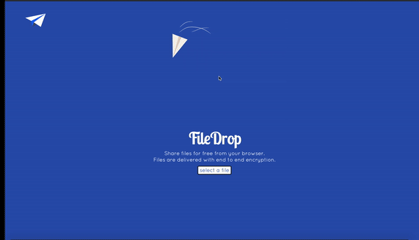

# File Drop

A peer to peer file transfer ReactJS and NodeJs application that allows users to transfer files from their browser

 

Filedrops allows immediate file transfer through the user's browser without having to store anything on the server. This is accomplished using the [WebRTC](http://www.webrtc.org) technology.
A link is generated once the user choses the file to share and the link can be shared with other users to share the file as long as the initial user's browser is open to establish the connection.

An instance of Filedrop is available [here](https://shrouded-wave-14872.herokuapp.com/).

## Development

    $ git clone https://github.com/abdamin/filedrop.git
    $ npm install
    $ npm run build
    $ npm start
